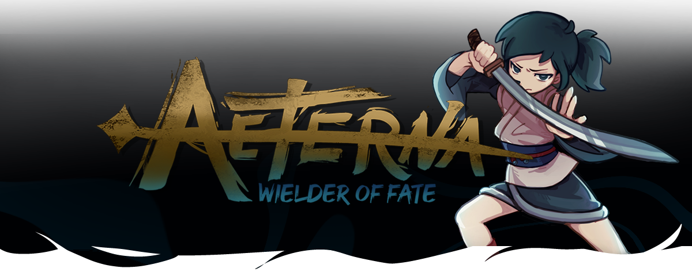

# Aeterna: Wielder of Fate

Aeterna: Wielder of Fate is an action roguelike inspired by Japanese folklore and Cartomancy. Explore the ever-changing halls and chambers of the temple and fight to save the goddess from her imprisonment.

## Credits

- **Ignacio Arrastua** - *Programming & Project Manager*  
- **Enzo Coletta** - *Programming*
- **Facundo Santos** - *Programming*
- **Zoe Cazas Telias** - *Art*
- **Anastasia Genero** - *Art*
- **Lara Menendez** - *Art*
- **Francisco Minaverry** - *Game Design*
- **Juan Sebastian Rey** - *Audio*
- **Alan Ezequiel Aguirre** - *Audio*

## Links

Download it from itch.io: https://michibrujas.itch.io/aeterna
